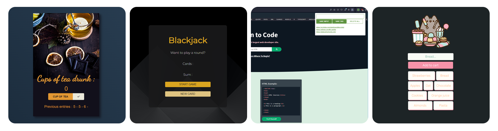

# JavaScript Basics 
This repository showcases my collection of 4 projects created during the "Learn JavaScript" course on the [Scrimba](https://scrimba.com/learn/learnjavascript) online platform.  
This course contains 207 interactive screencasts spread across 8 modules (~10hrs30).

## Projects

▪ Counting App : [CodePen](https://codepen.io/M-Laetitia/pen/PoXpQbb)  
▪ BlackJack App : [CodePen](https://codepen.io/M-Laetitia/pen/bGOqLxL)  
▪ Chrome Extension  
▪ Grocery List App : [CodePen](https://codepen.io/M-Laetitia/pen/MWZpVKM)  

